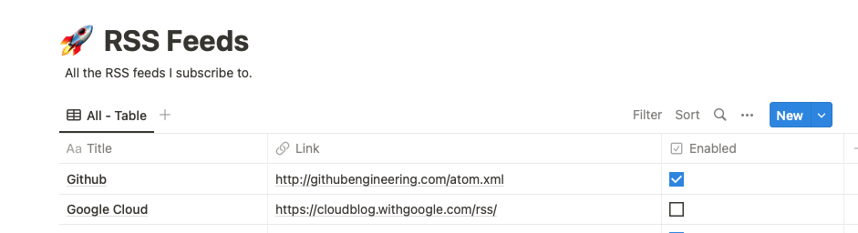
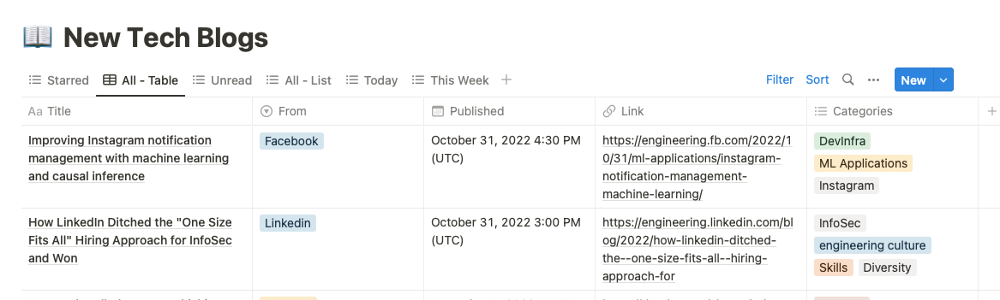

# notion-rss
Get RSS feeds in notion.so daily

## Overview
notion-rss lets you manage and retrieve all your RSS feeds in Notion.so.

One can add rss feeds, and every day, a cron Github Action will trawl your RSS feeds for new content.

Then you can find them all in Notion.so

## Usage
1. Fork the repo (it sets up Github Actions, etc)
2. Create two databases in Notion with the properties defined below.
3. Create a notion connection and get an API token.
4. Add Github action secrets defined [below](#github-action-secrets) 
5. Populate your Feeds Database in Notion
6. Wait until tomorrow for new RSS content (or manually run the Github action .github/workflow/cron.yml)

## Database Interface
This project uses two notion databases: to store RSS links (to subscribe to), to store the RSS content. 

### Feeds Database

| Property Name | Property Type |
| --- | :-- |
| Title | title |
| Link | url |
| Enabled | checkbox |

### Content Database

| Property Name | Property Type |
| --- | :-- |
| Title | title |
| Link | Url |
| Enabled | Checkbox |
| From | Select |
| Categories | MultiSelect |
| Published | Date |
| Starred | Checkbox |
| Created | Date |

## Github Action Secrets
Github Secrets needed in the repository for the workflow actions to work:
- `NOTION_API_TOKEN`: notion.so api token for a specific integration. Integration must have access to `NOTION_RSS_CONTENT_DATABASE_ID` and `NOTION_RSS_FEEDS_DATABASE_ID`.     
- `NOTION_RSS_CONTENT_DATABASE_ID`: notion.so database id that stores RSS content (see Database Interface / Content Database).
- `NOTION_RSS_FEEDS_DATABASE_ID`: notion.so database id that stores RSS feed details (see Database Interface / Feeds Database).

## Nice to haves
1. Use rss.Item.Content into notion blocks so the content can be viewed in Notion.
2. Convert combined RSS feeds into single feed: https://github.com/gorilla/feeds

### Improve Code Quality
1. Use release binary in `.github/workflows/release.yml`.
2. Write unit tests
3. Write integration tests
4. Finish Github action to run unit and integration tests.
5. Add in Precommit
6. Add in badging on README.
7. Replicate Github actions with local scripts